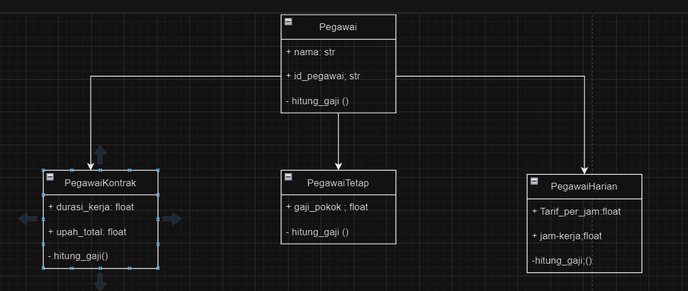

# Pegawai - Contoh Sederhana Pemrograman Berorientasi Objek (OOP) dengan Python

Ini adalah contoh sederhana implementasi pemrograman berorientasi objek (OOP) dengan menggunakan Python. Program ini mencakup tiga kelas dasar yang menggambarkan berbagai jenis pegawai, yaitu pegawai tetap, pegawai harian, dan pegawai kontrak.

## Struktur Kelas

- Kelas `Pegawai` adalah kelas dasar yang memiliki atribut `nama` dan `id_pegawai`. Kelas ini juga memiliki metode abstrak `hitung_gaji()`, yang harus diimplementasikan oleh kelas turunan.
- Kelas `PegawaiTetap` adalah turunan dari `Pegawai`. Kelas ini memiliki atribut tambahan `gaji_pokok` dan mengimplementasikan metode `hitung_gaji()` untuk menghitung gaji pegawai tetap.
- Kelas `PegawaiHarian` adalah turunan dari `Pegawai` dengan atribut tambahan `tarif_per_jam` dan `jam_kerja`. Kelas ini mengimplementasikan metode `hitung_gaji()` untuk menghitung gaji pegawai harian.
- Kelas `PegawaiKontrak` adalah turunan lain dari `Pegawai` dengan atribut `durasi_kerja` dan `upah_total`. Kelas ini juga mengimplementasikan metode `hitung_gaji()` untuk menghitung gaji pegawai kontrak.

## Cara Menggunakan

1. Jalankan program Python di mana Anda telah mendefinisikan kelas-kelas tersebut.
2. Program akan meminta Anda untuk memasukkan data pegawai sesuai dengan jenis pegawai yang Anda pilih.
3. Setelah memasukkan data pegawai, program akan menampilkan daftar pegawai beserta perhitungan gaji masing-masing.

## Contoh Penggunaan

Berikut adalah contoh penggunaan program:

1. Pilih jenis pegawai (tetap/harian/kontrak): tetap
2. Nama pegawai: John
3. ID pegawai: 123
4. Gaji pokok: 5000

Daftar Pegawai:
- John (123): Gaji = 5000.0

